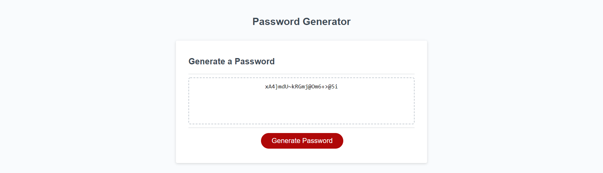

# Password Generator

## Introduction

This is a random password generator. It accepts user prompts and choices to generate a valid password with appropriate character choices and length. Safety measures are built in to ensure that calculations are executed with valid inputs only.

## Features

When the user presses the button, functions are called to randomly generate a new password. The user will be asked to decide the length by giving a number value. If the number is not an integer, it will be rounded. If the input is not a number, is greater than 128 or less than 8, the user will be prompted again for a different input.

The user will be asked to choose uppercase letters, lowercase letters, numbers and/or special characters for their password. If none are chosen, an alert will pop up to signify the error, and no further calculation will be done.

When all settings are provided and valid, a random password of determined length will be generated and printed on screen. Measures are taken to ensure that all allowed character types will be used in the generated password. Clicking the button will initiate the entire process again to generate a new password.

## User Story

```
AS AN employee with access to sensitive data
I WANT to randomly generate a password that meets certain criteria
SO THAT I can create a strong password that provides greater security
```

## Acceptance Criteria

```
GIVEN I need a new, secure password
WHEN I click the button to generate a password
THEN I am presented with a series of prompts for password criteria
WHEN prompted for password criteria
THEN I select which criteria to include in the password
WHEN prompted for the length of the password
THEN I choose a length of at least 8 characters and no more than 128 characters
WHEN prompted for character types to include in the password
THEN I choose lowercase, uppercase, numeric, and/or special characters
WHEN I answer each prompt
THEN my input should be validated and at least one character type should be selected
WHEN all prompts are answered
THEN a password is generated that matches the selected criteria
WHEN the password is generated
THEN the password is either displayed in an alert or written to the page
```

## Deployed URL

https://runescape11111.github.io/Password-Generator/

## Screenshot

Randomly generated password with length 22 and all characters enabled:

